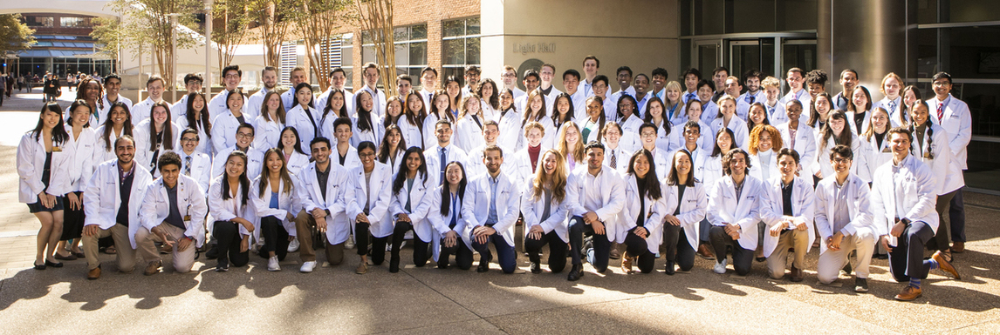
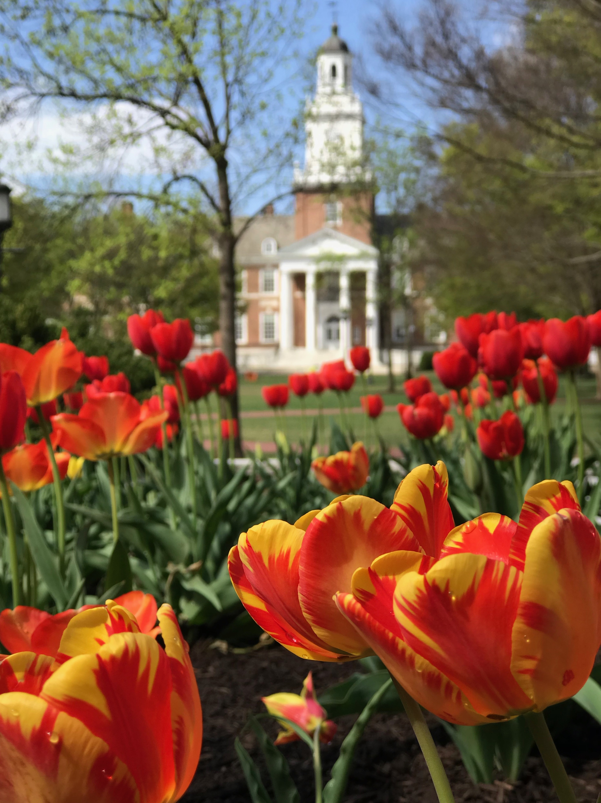

I am a medical student at Vanderbilt University School of Medicine. I currently conduct research on head and neck free flap management, surgical outcomes after neoadjuvant immunotherapy, surgical and patient-facing technology, and patient-centered surgical consent forms. I also volunteer as a student clinician/coordinator at [Shade Tree Free Clinic](https://www.shadetreeclinic.org/), health educator for previously incarcerated individuals, and [mentor](https://www.newschannel5.com/news/giving-them-another-path-inspiring-at-risk-youth-to-choose-a-violence-free-future) for children affected by gun violence.

I graduated from Johns Hopkins University in December 2021 with a B.A. in Biophysics and a Minor in Bioethics. At Johns Hopkins Hospital, I worked at the Wilmer Eye Institute's mobile free clinic and the [Disability Health Research Center](https://disabilityhealth.jhu.edu/). As an undergraduate student, I taught an Organic Chemistry Lab section as a teaching assistant and conducted basic science cancer research for three years at the [Institute for NanoBioTechnology](https://inbt.jhu.edu/). Additionally, I led my IRB-approved study called *Peer Influence on Vaping in High Schools* as well as two COVID-19 research projects on health website accessibility and restrictive policies in fragile Middle Eastern countries. I also volunteered in a hospice center to help provide palliative care to terminally ill children. 
<html>
<head>
  <!-- Add the Font Awesome CSS link below -->
  <link rel="stylesheet" href="https://cdnjs.cloudflare.com/ajax/libs/font-awesome/6.0.0-beta3/css/all.min.css">
  <!-- Add any necessary meta tags, CSS, or other dependencies in the head section -->
  
</head>
<body>
  

    

      <h2>Education</h2>
      
<i class="fas fa-graduation-cap" aria-hidden="true"></i> <b>Johns Hopkins University</b> <i>B.A. Biophysics, Bioethics Minor - 2021</i>

      
<i class="fas fa-graduation-cap" aria-hidden="true"></i> <b>Vanderbilt University School of Medicine</b> <i>Doctor of Medicine - Expected 2026</i>

    

    

      <h2>Interests</h2>
      <ul>
        <li>Biomedical Ethics</li>
        <li>Head and Neck Cancer</li>
        <li>Health Equity</li>
        <li>Medical Technology</li>
        <li>Surgical Outcomes</li>
      </ul>
    

  

</body>
</html>

 
During the six months before medical school, I continued working at Johns Hopkins Hospital as a research coordinator in the Department of Pediatrics. I led research projects on parents' trust in messengers of COVID-19-related information, children’s early determinants of illness, and primary care being central to improving both health equity and civic engagement. I also worked as a Postbaccalaureate fellow in NIDA’s [Technology and Translational Research Unit](https://bcurtislab.com/), where I researched stigmatizing online substance use discussions using natural language processing (NLP) and machine learning. 

Throughout my medical journey, I aspire to continue becoming a better person through each of my patients as well as spearheading surgical outcomes research, medical technology innovation, and advocacy for equitable healthcare and patients’ rights.

<html>
<head>
  
</head>
<body>
  

    

      <!-- First image -->
      
      
Gilman Hall, Johns Hopkins University

    

    

      <!-- Second image -->
      
      
Nashville, TN

    

  

</body>
</html>
