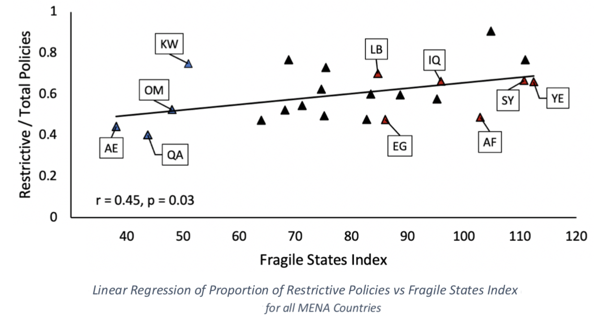

---	
title: "The balance between health resource-oriented and restrictive COVID-19 policies in the Middle East"	
collection: talks	
permalink: /talks/2021-10-5-habib2021balance	
date: 2021-10-5
type: "Oral Presentation"
venue: 'COVID-19 Public Health and Social Measures Research Outcome Conference'
location: "Virtual"
---	
This presentation highlighted disparities in how Middle Eastern countries with different fragility scores handled the COVID-19 pandemic. 
  
Recommended citation: **Habib D**, Elmore N, Gulas S, Ruhde N, Mathew D. The balance between health resource-oriented and restrictive COVID-19 policies in the Middle East. Oral presentation at: COVID-19 Public Health and Social Measures Research Outcome Conference; October 5; 2021; Virtual.
  

