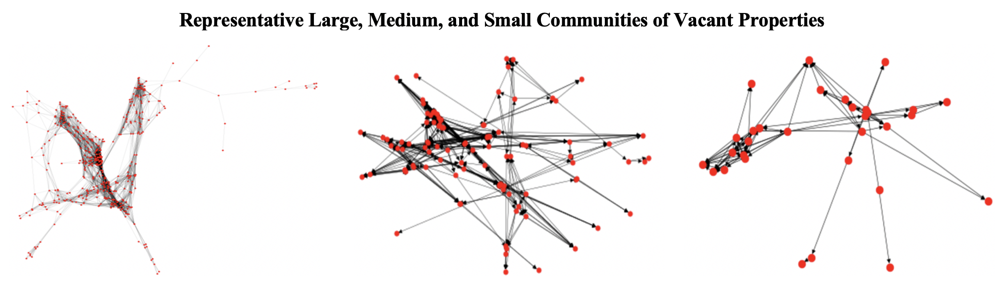

---	
title: "A preliminary network analysis of blighted neighborhoods in Baltimore City"	
collection: talks	
permalink: /talks/2022-07-14-mitsinikos2022preliminary
date: 2022-07-14
type: "Oral Presentation"
venue: 'XLII International Social Networks Conference'
location: "Virtual"
---	
Although literature exists on the contagion effect of neighborhood blight, this study aims to take the field a step further by applying network analysis to the spread of vacant properties in Baltimore. Data on vacant properties from Open Baltimore were used to create a city-wide network of vacancies. The spread of neighborhood blight was measured in different sized communities, and network metrics were leveraged to select what vacancies upon rehabilitation would minimize the influence of neighborhood blight on future vacancies. Rehabilitation programs were found to be most effective when they had a larger number of possible rehabilitations, began earlier, and selected vacant properties that exhibited higher connectivity. Although currently available network metrics are not ideal for minimizing neighborhood blight, the use of outdegree shows promise to warrant future work on developing predictive algorithms that can estimate what properties would likely become vacant and hence whose predecessors should be targeted for rehabilitation. When supplemented with sociodemographic considerations and predictive algorithms, these findings can inform the optimal selection of vacancies to rehabilitate and thus most effectively mitigate the spread of neighborhood blight.
 
  
Recommended citation: Mitsinikos C, **Habib D**. A preliminary network analysis of blighted neighborhoods in Baltimore City. Oral presentation at: XLII International Social Networks Conference; July 14, 2022; Virtual.
  

 
