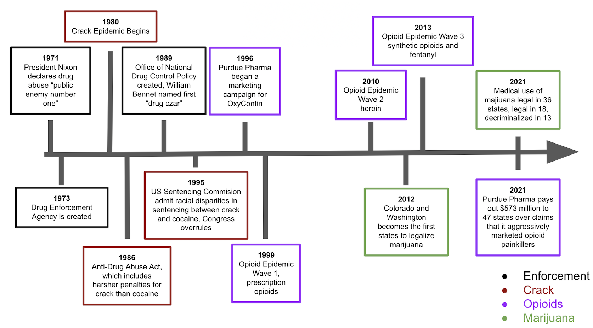

---	
title: "Trends in the dehumanization of people who use drugs in American news articles from 1986 to 2020"	
collection: talks	
permalink: /talks/2022-11-09-habib2022trends
date: 2022-11-09
type: "Round Table Presentation"
venue: 'American Public Health Association Annual Meeting'
location: "Boston, MA, USA"
---	
This presentation leveraged big data to study dehumanizing language throughough the War on Drugs to today. We discovered trends that can help inform humanization strategies specific to each substance to which stereotypes are attributed.
  
Recommended citation: **Habib D**, Curtis B, Giorgi S, Bellew D. Trends in the dehumanization of people who use drugs in American news articles from 1986 to 2020. Round table presentation at: American Public Health Association Annual Meeting; November 9, 2022; Boston, MA, USA.
  

