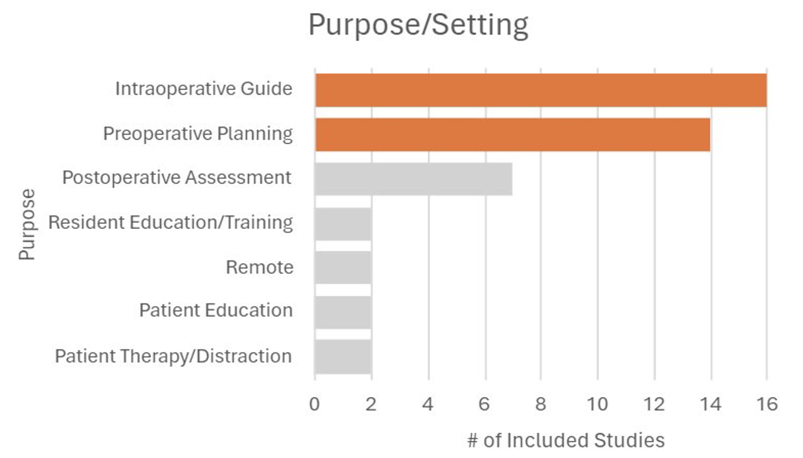

---	
title: "Augmented reality in facial plastic & reconstructive surgery: A systematic review"	
collection: talks	
permalink: /talks/adegboye2024augmented
date: 2024-05-15
type: "Poster"
venue: 'Combined Otolaryngology Spring Meetings'
location: "Chicago, IL, USA"
---	
This [poster](https://danielrshabib.github.io/files/adegboye2024augmented-poster.pdf) discussed the applications, uses, and limitations of augmented reality (AR) in facial plastics and reconstructive surgery (FPRS). The most significant areas of application are within hard tissue reconstructions such as orthognathic surgery and trauma. AR has a significant applications in preoperative planning, intraoperative guidance, and postoperative assessment. The most common AR modality is head-mounted display, with computer-assisted design (CAD)/computer-assisted modification (CAM) and mobile app/monitor following closely behind.​ Soft tissue AR visualization, manual registration not keeping up with tissue rearrangement, and AR availability/unfamiliarity are challenges for AR applications in FPRS to break past its predominantly preclinical stage.​
  
Recommended citation: Adegboye F, Si CD, **Habib DRS**, Stephan SJ, Patel PN, Yang SF. Augmented reality in facial plastic & reconstructive surgery: A systematic review. Poster presented at: Combined Otolaryngology Spring Meetings; May 15, 2024; Chicago, IL, USA. 
  

