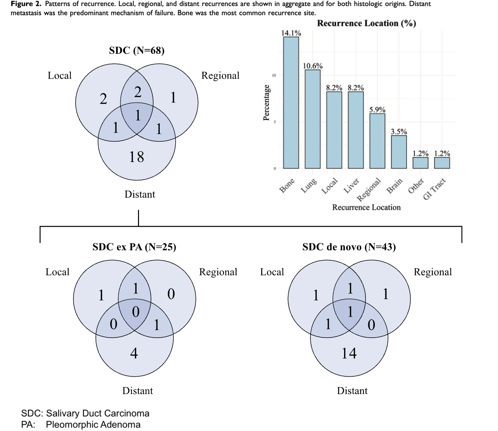

---	
title: "Histologic origin as a prognostic factor in salivary duct carcinoma"
collection: talks	
permalink: /talks/gao2025histologic
date: 2025-10-12
type: "Oral Presentation"
venue: 'American Academy of Otolaryngology-Head and Neck Surgery Annual Meeting'
location: "Indianapolis, IN, USA"
---	
Salivary duct carcinoma (SDC) is an aggressive cancer, and it remains unclear whether its origin affects outcomes. In this study of 68 patients, we found that survival did not differ significantly between cancers arising <i>de novo</i> and those developing from a benign pleomorphic adenoma, though patients with ex-pleomorphic adenoma SDC had numerically higher 2-year survival rates (87% vs 81%). Distant recurrence was the most common form of treatment failure, occurring in 35% of patients overall and more frequently in <i>de novo</i> cases (37% vs 20%). Pathologic lymph node involvement was the only independent predictor of recurrence, highlighting the importance of nodal status in prognosis and supporting the need for earlier systemic treatment strategies to prevent distant spread.
  
Recommended citation: Gao L, Sridhar S, **Habib DRS**, Topf M, Langerman A. Histologic origin as a prognostic factor in salivary duct carcinoma. Oral presentation at: American Academy of Otolaryngology-Head and Neck Surgery Annual Meeting; October 12, 2025; Indianapolis, IN, USA. 
  

    

