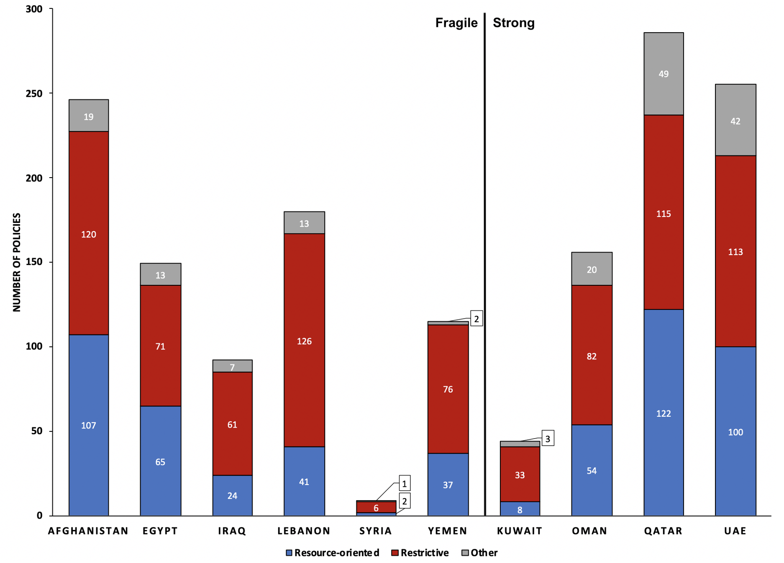

---	
title: "The ethics of restrictions in the Middle East’s COVID-19 response"	
collection: talks	
permalink: /talks/habib2021ethics	
date: 2021-5-22
type: "Oral Presentation"
venue: '39th Annual Mid-Atlantic Undergraduate Social Research Conference'
location: "Virtual"
---	
This presentation discussed differences in policy implementation between strong and fragile Middle Eastern states during the COVID-19 pandemic. Fragile states instated restrictive policies more frequently, with no specific type of restriction accounting for the entire difference. Business regulation was the most notable restriction enforced by strong states.
  
Recommended citation: **Habib D**, Elmore N, Gulas S, Ruhde N, Mathew D. The ethics of restrictions in the Middle East’s COVID-19 response. Oral presentation at: 39th Annual Mid-Atlantic Undergraduate Social Research Conference; April 22, 2021; Virtual.
  

    

