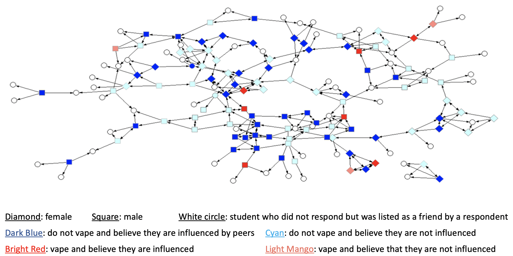

---	
title: "Applying social network theory to vaping in high school: Implications for school-based prevention programs"	
collection: talks	
permalink: /talks/habib2022applying	
date: 2022-07-15
type: "Oral Presentation"
venue: 'XLII International Social Networks Conference'
location: "Virtual"
---	
Vaping in high schools has skyrocketed partly due to social factors. Peer influence on risky behavior is especially potent in adolescence and varies by gender. Smoking prevention programs focused on peer-group leaders have shown great promise, and a social influence model has proved effective in understanding adult smoking networks but has not been applied to adolescent vaping. This study applies the social influence model to vaping in a high school social network and helps inform school-based vaping prevention programs by examining the roles of social network centrality and gender on vaping behavior. An online survey was emailed to a high school’s student body asking for gender, age, grade level, vape status, self-reported peer influence status, and the names of three friends. Available at [github.com/njha02/surveyAnalysis](https://github.com/njha02/surveyAnalysis), custom Java and MATLAB scripts were used to read the survey data spreadsheet, create a directed graph, compute centrality measures, and perform student’s t-tests to compare centrality measures by gender and vape status. Of 192 students in the school, 102 students responded to the survey. Students who vape were in more tightly knit friend groups than students who do not vape (p<0.05). Compared to males who vape, females who vape had more social ties to other students who vape, exhibiting greater homophily (p<0.01). Compared to females who do not vape, females who vape were in more tightly knit friend groups (p<0.05) and had more ties to other students who vape (p<0.01). Applying social network theory can reveal previously untapped information to address vaping among a unique student body. In this case, an intervention targeting close-knit networks may prove more effective for females than males, but establishing trends across student bodies requires additional research to control for differences between schools (e.g., public/private or urban/rural). This study supports a general framework for assessing peer-influenced behavior.
  
Recommended citation: **Habib D**, Jha Na, Jha Ni, Curtis B. Applying social network theory to vaping in high school: Implications for school-based prevention programs. Oral presentation at: XLII International Social Networks Conference; July 15, 2022; Virtual.
  
 
