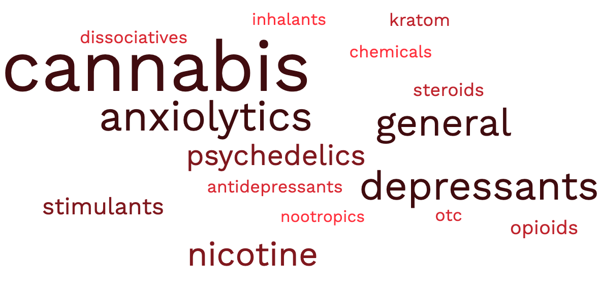

---	
title: "Novel substance use and support themes on Reddit: Lessons for researchers and practitioners"	
collection: talks	
permalink: /talks/habib2023novel
date: 2023-11-14
type: "Poster"
venue: 'American Public Health Association Annual Meeting'
location: "Atlanta, GA, USA"
---	
This poster discussed how to leverage big data from Reddit to identify and analyze substance use and support themes in popular subreddits related to substance use. This project captured fast-evolving substance use and harm-reduction patterns that can improve practitioners’ understanding of diverse substance use experiences. Additionally, our annotated list of subreddits will help researchers immediately identify relevant online communities to monitor emerging substances and routes of administration, identify benefits of digital recovery networks, analyze substance use and support language, and develop targeted secondary prevention strategies.
  
Recommended citation: **Habib D**, Giorgi S, Kady A, Demko Z, Curtis B. Novel substance use and support themes on Reddit: Lessons for researchers and practitioners. Poster presented at: American Public Health Association Annual Meeting; November 14, 2023; Atlanta, GA, USA. 
  

