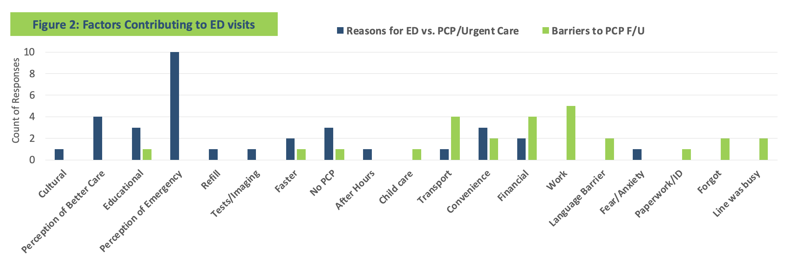

---	
title: "Facilitating primary care connections for emergency department discharge patients"	
collection: talks	
permalink: /talks/habib2024facilitating
date: 2024-09-24
type: "Poster"
venue: 'American Interprofessional Health Collaborative Nexus Summit'
location: "Virtual"
---	
This [poster](https://danielrshabib.github.io/files/habib2024facilitating-poster.pdf) addresses Emergency Department (ED) overcrowding and barriers to primary care physician (PCP) follow-up. Our interprofessional team identified patients with chronic conditions in the ED, conducted telephone surveys, provided primary care education, and linked patients with appropriate clinics. Of the 78 patients identified, 67 were reachable, and 18 completed the survey. Barriers included language, financial insecurity, and low medical literacy. Post-education, all patients correctly defined a PCP. In sum, many patients visit the ED due to barriers in accessing primary care and a lack of understanding of PCPs. Addressing these barriers, considering individual complexities, and expanding social work support are crucial to reducing ED overcrowding and improving health equity.
  
Recommended citation: **Habib DRS**, Labenberg A, Bilicki M. Facilitating primary care connections for emergency department discharge patients. Poster at: American Interprofessional Health Collaborative Nexus Summit; September 24, 2024; Virtual.
  

