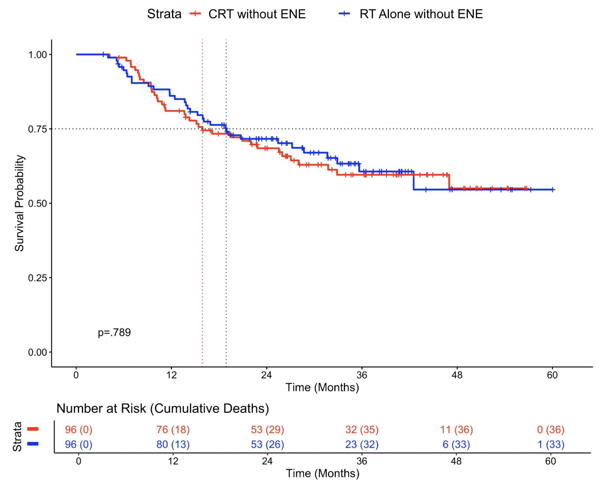

---	
title: "Adjuvant chemotherapy does not improve overall survival in positive surgical margin oral cavity cancer patients without extranodal extension"	
collection: talks	
permalink: /talks/habib2025adjuvant	
date: 2025-05-15
type: "Poster"
venue: 'American Head and Neck Society Annual Meeting at COSM'
location: "New Orleans, LA, USA"
---	
The benefit of adjuvant chemoradiotherapy (CRT) over radiotherapy (RT) alone for oral cavity squamous cell carcinoma (OCSCC) patients with positive margins but no extranodal extension (ENE) remains unclear after two landmark clinical trials (EORTC 229311 and RTOG 95-01) included only a small minority of patients with positives margins and no ENE. Among a matched cohort of National Cancer Database (NCDB) patients with positive margins but no ENE, this [poster](https://danielrshabib.github.io/files/habib2025adjuvant-poster.pdf) found no overall survival (OS) benefit for CRT compared to RT alone. These findings highlight the need for further research to refine adjuvant therapy recommendations for specific high-risk groups.
  
Recommended citation: **Habib DRS**, Li Y, Tassone P, Philips RH, Yalamanchi P, Holsinger FC, Topf MC. Adjuvant chemotherapy does not improve overall survival in positive surgical margin oral cavity cancer patients without extranodal extension. Poster presented at: American Head and Neck Society Annual Meeting at COSM; May 15, 2025; New Orleans, LA, USA. 
  

    

