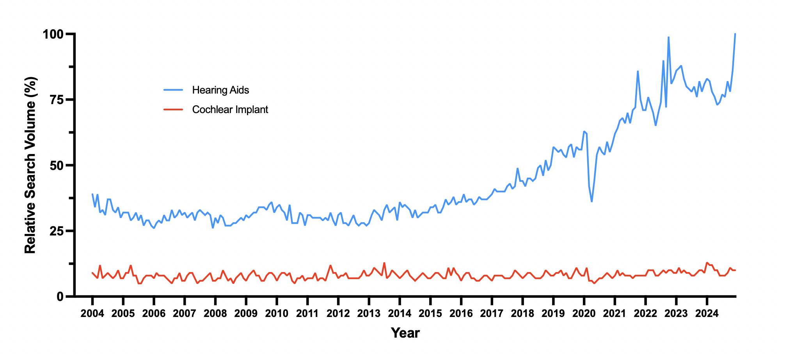

---	
title: "Association between hearing aid and cochlear implant internet searches with media campaigns and federal announcements”	
collection: talks	
permalink: /talks/habib2025association
date: 2025-10-11
type: “Poster"
venue: 'American Academy of Otolaryngology-Head and Neck Surgery Annual Meeting'
location: "Indianapolis, IN, USA"
---	
Many people who could benefit from hearing aids or cochlear implants do not use them, partly due to high costs and low public awareness. This [poster](https://danielrshabib.github.io/files/habib2025association-poster.pdf) looked at Google search trends from 2004 to 2024 to measure awareness of these devices and found that searches for hearing aids increased over time, while cochlear implant searches stayed low. Some major events—like new device approvals or awareness days—briefly boosted search interest, but others had little effect. With cochlear implants costing nearly $45,000 compared to $5,000 for hearing aids, better education and cost transparency may help improve access to these devices. 
  
Recommended citation: **Habib DRS**, Bishay AE, Langerman AJ, Tawfik KO. Association between hearing aid and cochlear implant internet searches with media campaigns and federal announcements. Poster presented at: American Academy of Otolaryngology-Head and Neck Surgery Annual Meeting; October 11, 2025; Indianapolis, IN, USA.
  

