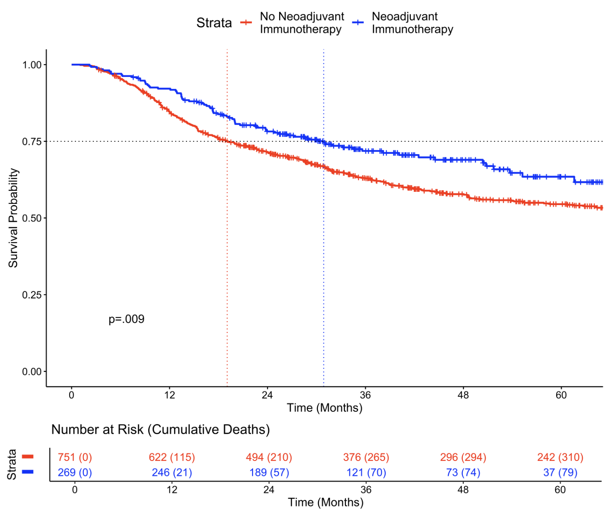

---	
title: "Outcomes following neoadjuvant immunotherapy for oral cavity cancer: A propensity score matched analysis of the National Cancer Database"	
collection: talks	
permalink: /talks/habib2025outcomes	
date: 2023-05-15
type: "Poster"
venue: 'American Head and Neck Society Annual Meeting at COSM'
location: "New Orleans, LA, USA"
---	
This [poster](https://danielrshabib.github.io/files/habib2025outcomes-poster.pdf) discussed how neoadjuvant immunotherapy (NI) for oral cavity squamous cell carcinoma (OCSCC) is a promising approach, but its impact on surgical outcomes and survival has not been well studied. From over 31,000 patients, 1% receieved NI. We found that patients receiving NI had similar postoperative outcomes 30-day mortality, unplanned 30-day readmission, hospital length of stay, surgical margin status, and time to adjuvant radiation. However, NI was associated with improved overall survival, as shown by both Kaplan-Meier and Cox proportional hazard analyses. These findings suggest NI may enhance survival without worsening postoperative outcomes for OCSCC patients, pending validation through future clinical trial results. 
  
Recommended citation: **Habib DRS**, Shou M, Naranjo C, Adegboye FO, Philips R, Tassone P, Langerman A, Khan A, Topf MC. Outcomes following neoadjuvant immunotherapy for oral cavity cancer: A propensity score matched analysis of the National Cancer Database. Poster at: American Head and Neck Society Annual Meeting at COSM; May 15, 2025; New Orleans, LA, USA. 
  

    

