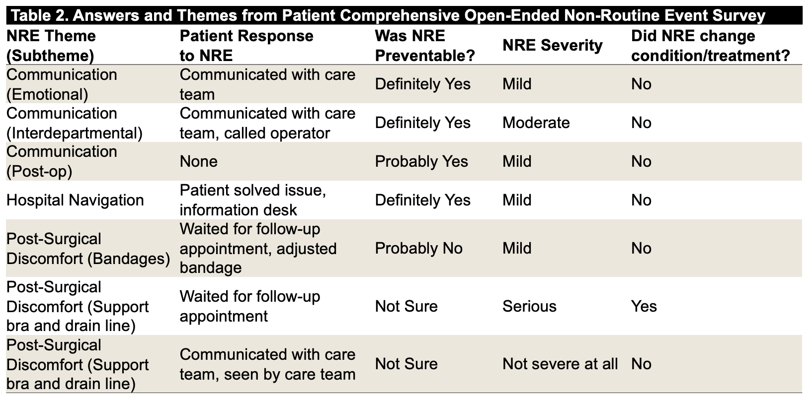

---	
title: "Patient-reported non-routine events for same-day discharge after mastectomy"	
collection: talks	
permalink: /talks/habib2025patient
date: 2025-04-06
type: "Poster"
venue: 'Southwestern Surgical Congress Annual Meeting'
location: "Sonoma, CA, USA"
---	
This [poster](https://danielrshabib.github.io/files/habib2025patient-poster.pdf) describes how patients discharged the same day as their mastectomy often encounter non-routine events (NREs), or deviations from expected medical care, that can significantly impact their experience. Patients reported NREs such as post-surgical discomfort, communication gaps, and challenges navigating the hospital. While most NREs were mild and preventable, they highlight the need for addressing uncertainties and establishing a reliable line of communication during the transition from hospital to home.
  
Recommended citation: **Habib DRS**, Sullivan LE, Salwei ME, Hewitt KC. Patient-reported non-routine events for same-day discharge after mastectomy. Poster presented at: Southwestern Surgical Congress Annual Meeting; April 6, 2025; Sonoma, CA, USA. 
  

