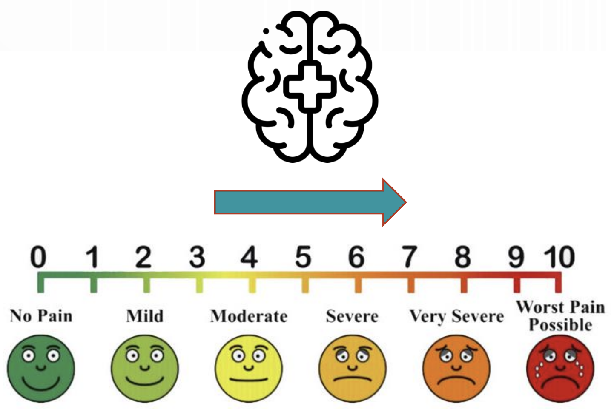

---	
title: "Risk factors for increased postoperative pain in head and neck cancer free flap reconstruction patients"
collection: talks	
permalink: /talks/habib2025risk
date: 2025-10-11
type: "Oral Presentation"
venue: 'American Academy of Otolaryngology-Head and Neck Surgery Annual Meeting'
location: "Indianapolis, IN, USA"
---	
Head and neck cancer patients undergoing free flap surgery often face significant postoperative pain, especially patients with mental health disorders (MHD) or prior narcotic use. In this [oral presentation](https://danielrshabib.github.io/files/habib2025risk-presentation.pdf) involving 645 patients, sociodemographic variables, MHD, and osteocutaneous radial forearm free flap reconstruction were linked to higher pain scores and increased likelihood of inpatient pain service consultation. These findings highlight the need for tailored, proactive pain management strategies based on individual risk factors.
  
Recommended citation: **Habib DRS**, Sridhar S, Suh H, Larson D, Swain BB, Vittetoe K, Sengstack D, Topf MC, Hicks MD. Risk factors for increased postoperative pain in head and neck cancer free flap reconstruction patients. Oral presentation at: American Academy of Otolaryngology-Head and Neck Surgery Annual Meeting; October 11, 2025; Indianapolis, IN, USA. 
  

    

