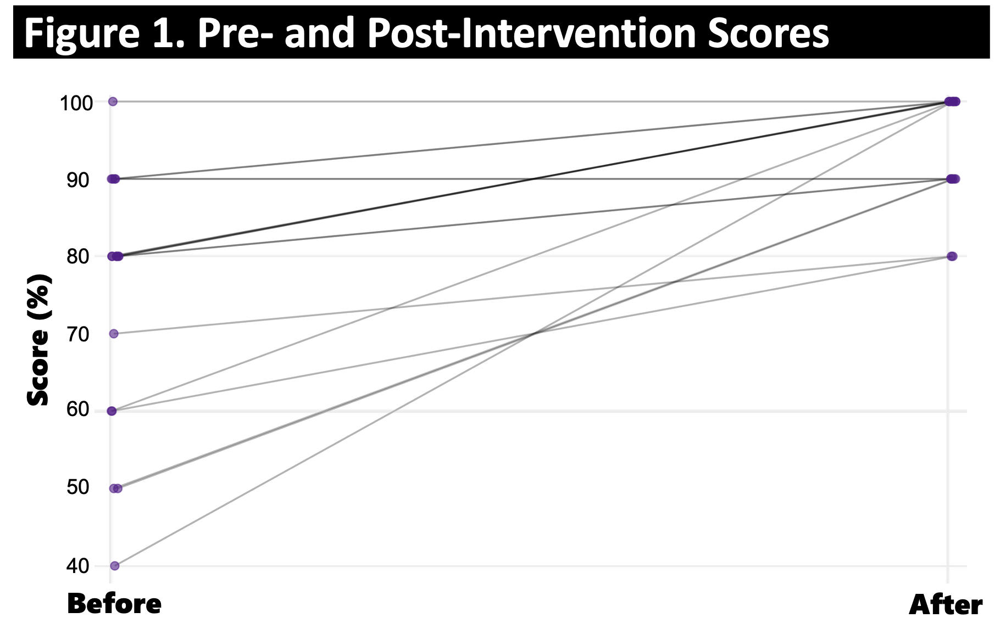

---	
title: "Self-paced sinusitis educational module for medical students: Improving otolaryngology knowledge for all future specialties"
collection: talks	
permalink: /talks/habib2025self
date: 2025-10-11
type: "Poster"
venue: 'American Academy of Otolaryngology-Head and Neck Surgery Annual Meeting'
location: "Indianapolis, IN, USA"
---	
Although ENT issues account for up to 50% of pediatric and 25% of adult primary care visits, most medical schools do not offer formal ENT education. This [poster](https://danielrshabib.github.io/files/habib2025self-poster.pdf) investigates whether a short online module could improve medical students’ knowledge about sinusitis, a common ENT condition, without significant additional time burden. Among 18 participating students, median test scores rose from 80% before the module to 100% afterward (p<.001), with most students completing the lesson in under 14 minutes. The results suggest that brief, focused ENT education can meaningfully improve student knowledge without adding significant time demands.
  
Recommended citation: **Habib DRS**, Naranjo C, Patel PN. Self-paced sinusitis educational module for medical students: Improving otolaryngology knowledge for all future specialties. Poster presented at: American Academy of Otolaryngology-Head and Neck Surgery Annual Meeting; October 11, 2025; Indianapolis, IN, USA. 
  

    

