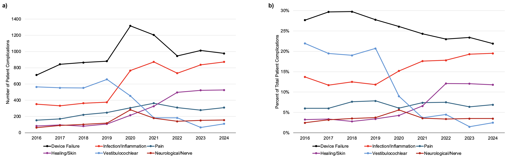

---	
title: "Trends in cochlear implant complications and clinical outcomes from 2016 to 2024"
collection: talks	
permalink: /talks/habib2025trends
date: 2025-10-11
type: "Oral Presentation"
venue: 'American Academy of Otolaryngology-Head and Neck Surgery Annual Meeting'
location: "Indianapolis, IN, USA"
---	
As cochlear implants (CIs) become more widely used, understanding long-term safety trends is increasingly important. In this [oral presentation](https://danielrshabib.github.io/files/habib2025trends-presentation.pdf) of over 34,000 patient complications and 33,000 device issues reported to the FDA from 2016 to 2024, we found that overall complication rates stabilized after 2020. However, certain problems—such as skin breakdown, infections, and device positioning issues—continued to rise as a proportion of all reports, along with serious outcomes like hospitalization. These findings suggest that while CI safety has improved overall, specific challenges remain and warrant focused improvements in device design, surgical technique, and post-market monitoring.
  
Recommended citation: **Habib DRS**, Bishay AE, Langerman AJ, Tawfik KO. Trends in cochlear implant complications and clinical outcomes from 2016 to 2024. Oral presentation at: American Academy of Otolaryngology-Head and Neck Surgery Annual Meeting; October 11, 2025; Indianapolis, IN, USA. 
  

