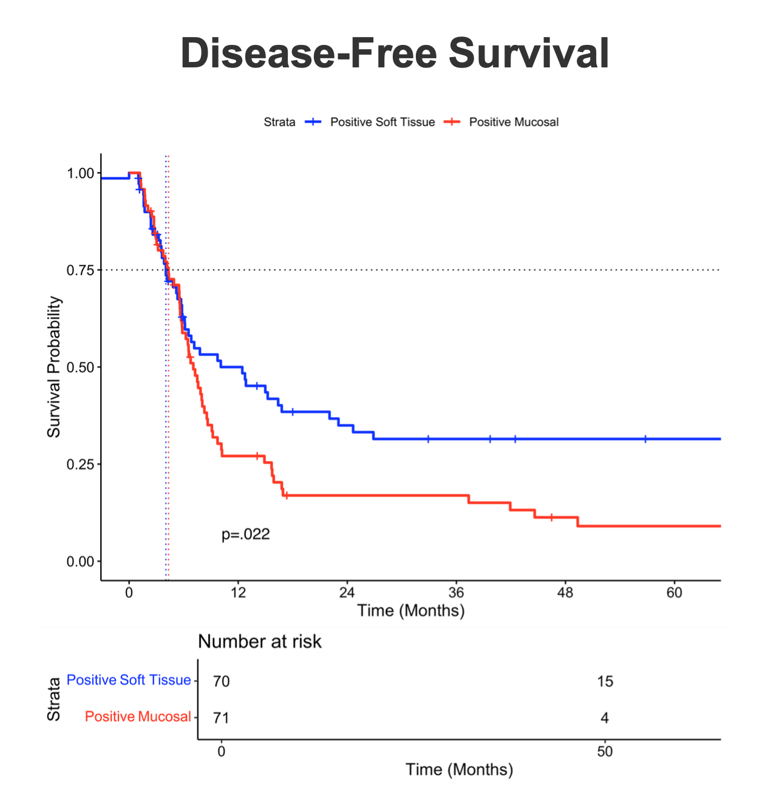

---	
title: "Impact of mucosal versus soft tissue positive final margin status on survival outcomes in total laryngectomy patients"	
collection: talks	
permalink: /talks/jin2026impact
date: 2026-01-22
type: "Poster"
venue: 'Triological Society Combined Sections Meeting'
location: "Orlando, FL, USA"
---	
Positive surgical margins after total laryngectomy (TL) are known to be linked to cancer recurrence and survival, but it is unclear whether the type of positive margin matters. This [poster](https://danielrshabib.github.io/files/jin2026impact-poster.pdf) found that patients with positive mucosal margins had worse disease-free survival (DFS) than those with positive soft tissue margins using Cox proportional hazard analysis, although this difference was no longer significant after adjusting for other factors. These findings suggest that mucosal margin positivity may represent a higher-risk group that could benefit from closer follow-up or more tailored postoperative treatment, pending future work in a larger cohort.
  
Recommended citation: Jin W, **Habib DRS**, Tassone P, Curry J, Topf MC. Impact of mucosal versus soft tissue positive final margin status on survival outcomes in total laryngectomy patients. Triological Society Combined Sections Meeting; January 22, 2026; Orlando, FL, USA.
  

    

