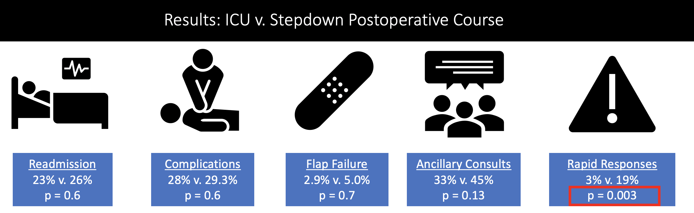

---	
title: "Flap to floor: Free flap comparative outcomes outside the ICU"	
collection: talks	
permalink: /talks/prasad2023flap
date: 2023-10-01
type: "Oral Presentation"
venue: 'American Academy of Otolaryngology-Head and Neck Surgery Foundation Annual Meeting'
location: "Nashville, TN, USA"
---	
This presentation examined operative outcomes for patients transferred to a general ward following microvascular free flap reconstruction of the head and neck as compared to patients transferred to an intensive care unit (ICU). We found that there was no change in overall hospital length of stay (LOS), postoperative complications, readmission rates, or flap failure rates. We found a significant decrease in ICU LOS despite a significant increase in rapid responses. Transfer to a stepdown unit rather than an ICU would allow for a better quality hospital experience with improved sleep, decreased cost of care, and a higher number of available ICU beds for patients in greater need of critical care management with no significant increase in postoperative complications.
  
Recommended citation: Prasad K, Stevens MN, Sharma R, **Habib D**, West M, Langerman A, Mannion K, Rosenthal E, Topf MC, Rohde S. Flap to floor: Free flap comparative outcomes outside the ICU. Oral presentation at: American Academy of Otolaryngology-Head and Neck Surgery Foundation Annual Meeting; October 1, 2023; Nashville, TN, USA.
  

