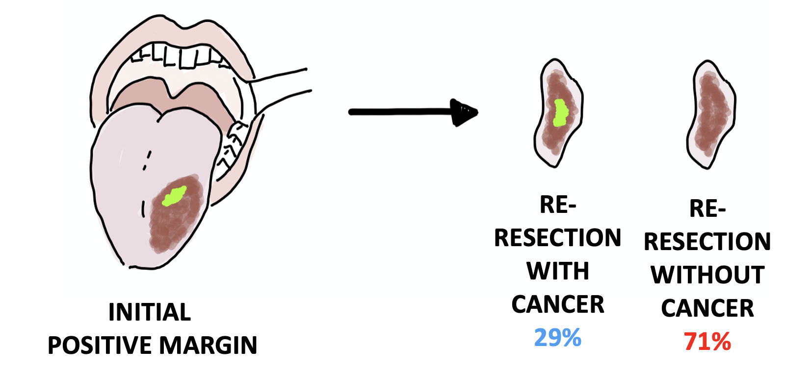

---	
title: "How often is cancer present in oral cavity re-resections after initial positive margins?"	
collection: talks	
permalink: /talks/prasad2023how	
date: 2023-05-04
type: "Poster"
venue: 'Combined Otolaryngology Spring Meetings'
location: "Boston, MA, USA"
---	
This [poster](https://danielrshabib.github.io/files/prasad2023how-poster.pdf) discussed the frequency of carcinoma in oral cavity re-resections, oncologic outcomes of reresection after a positive margin, and difficulties surgeons may experience relocating the site of positive margin and resecting the remaining cancer. 
  
Recommended citation: Prasad K, Sharma R, **Habib D**, Sinard R, Mannion K, Rohde S, Langerman A, Netterville J, Rosenthal E, Lewis JS, Topf MC. How often is cancer present in oral cavity re-resections after initial positive margins? Poster presented at: Combined Otolaryngology Spring Meetings; May 4, 2023; Boston, MA, USA.
  

