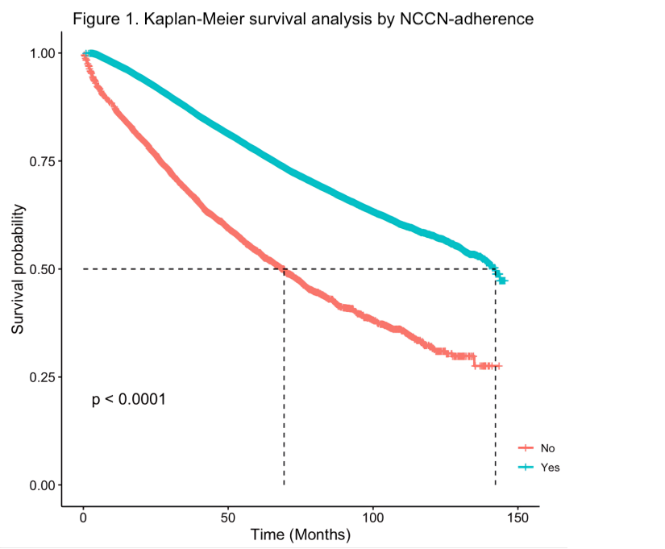

---	
title: "NCCN guideline adherence in rectal cancer and outcomes in low-volume vs. high-volume centers"	
collection: talks	
permalink: /talks/Shroder2024mood
date: 2024-06-02
type: "Poster"
venue: 'American Society of Colon and Rectal Surgeons Annual Scientific Meeting'
location: "Baltimore, MD, USA"
---	
This poster investigated if adherence to National Comprehensive Cancer Network (NCCN) guidelines would reduce disparities in oncologic outcomes between rectal cancer patients treated at high-volume and low-volume centers. Using 55,497 patients from the the National Cancer Database (NCDB), we found a survival benefit associated with adherence to NCCN guidelines and treatment at high-volume centers. While controlling for NCCN adherence alone does not remove the survival benefit at high-volume centers, this analysis shows that controlling for specific high-risk tumor and patient factors can mitigate this difference. 
  
Recommended citation: Shroder M, Bai K, **Habib DRS**, Ye F, Hawkins A, Khan A. NCCN guideline adherence in rectal cancer and outcomes in low-volume vs. high-volume centers. Oral presentation at: American Society of Colon & Rectal Surgeons Annual Scientific Meeting. June 2, 2024; Baltimore, MD, USA. 
  

    

 
