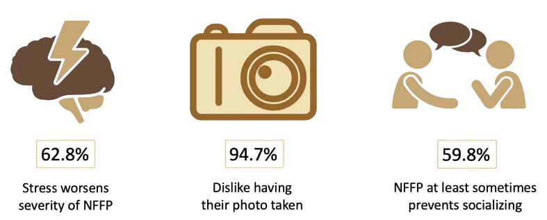

---	
title: "The unseen burden of non-flaccid facial paralysis: Patient-reported psychosocial impact and treatment experience"
collection: talks	
permalink: /talks/vittetoe2025unseen
date: 2025-09-25
type: "Oral Presentation"
venue: 'International Facial Nerve Symposium'
location: "Madrid, Spain"
---	
This [oral presentation](https://danielrshabib.github.io/files/vittetoe2025unseen-presentation.pdf) examines the psychosocial burden of non-flaccid facial paralysis (NFFP) and patient perceptions of treatment efficacy. A survey conducted among patients revealed that stress exacerbates NFFP symptoms for 62.8% of respondents, with many expressing concerns about their appearance and its impact on social interactions. Despite the significant emotional distress, only 27.3% of patients sought regular mental health support, though treatments like chemodenervation were found to effectively reduce self-consciousness and self-criticism. The findings underscore the profound effects of NFFP on self-image and social well-being, emphasizing the necessity for integrated care approaches that include mental health resources.
  
Recommended citation: Vittetoe K, Barna AJ, Adegboye FO, **Habib DRS**, Stephan SJ, Patel PN, Yang SF. The unseen burden of non-flaccid facial paralysis: Patient-reported psychosocial impact and treatment experience. Oral presentation at: International Facial Nerve Symposium; September 25, 2025; Madrid, Spain. 
  

    

