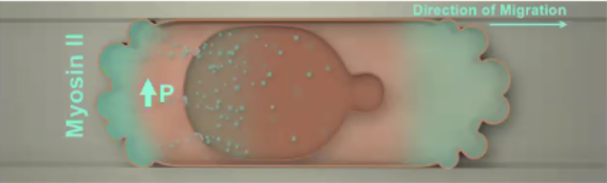

---	
title: "Nuclear stiffening along with RhoGEF activity regulate RhoA/MyosinII-dependent contractility and cell migration phenotype in confinement"	
collection: talks	
permalink: /talks/wisniewski2020nuclear	
date: 2020-10-16
type: "Poster"
venue: 'Biomedical Engineering Society Annual Meeting'
location: "Virtual"
---	
This presentation highlighted signaling pathways that are activated in invasive breast cancer cells when nuclei are confined during migration in synthetic microfluidic devices – a finding that can be extrapolated to contricted passageways in the body such as pre-existing perineural spaces and bone cavities or channels created by macrophages and cancer-associated fibroblasts through ECM remodeling.
  
Recommended citation: Wisniewski E, Mistriotis P, Bera K, Zhang J, Nikolic M, Tuntithavornwat S, Law R, Zhao R, **Habib D**, Kalab P, Scarcelli G, Konstantopoulos K. Nuclear stiffening along with RhoGEF activity regulate RhoA/MyosinII-dependent contractility and cell migration phenotype in confinement. Poster presented at: Biomedical Engineering Society Annual Meeting; October 16, 2020; Virtual.
  

