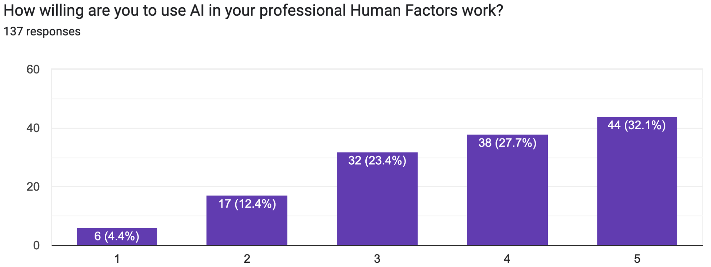

---	
title: "Navigating uncharted waters: The AI revolution in human factors workflows" 
collection: talks 
permalink: /talks/yovanoff2026navigating 
date: 2026-03-23 
type: "Panel" 
venue: 'International Symposium on Human Factors and Ergonomics in Health Care' 
location: "New York, NY, USA"
---	
Large Language Models (LLMs) are rapidly transforming workflows across all sectors, yet their integration carries both substantial benefits and potential risks that require careful oversight from human factors engineering (HFE) professionals. This panel brought together experts to share experiences integrating LLMs into their work, utilizing the Complementary Ability-Function-Role (CAFR) framework to examine HFE-LLM collaboration across creative phases: discover, define, develop, and deliver. Through interactive audience polling and structured discussion of successes, failures, organizational challenges, and responsible adoption strategies, the panel explored both opportunities and cautionary considerations for AI integration. We discussed successful LLM applications, common pitfalls, and frameworks for intentional AI-human collaboration that leverage each agent's strengths rather than replacing human expertise.

  Recommended citation: Yovanoff M, Hayna KL, Psota S, **Habib DRS**, Marber M. Navigating uncharted waters: The AI revolution in human factors workflows. Panel at: International Symposium on Human Factors and Ergonomics in Health Care; March 23, 2026; New York, NY, USA.
  

    

